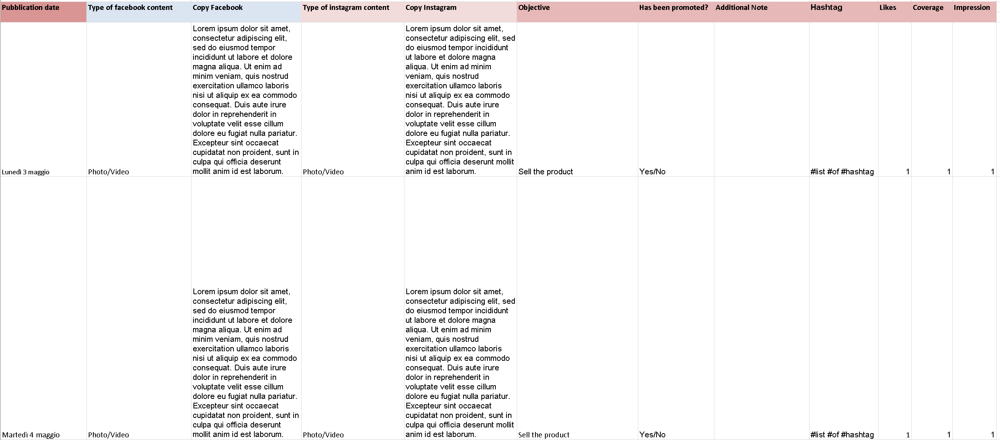
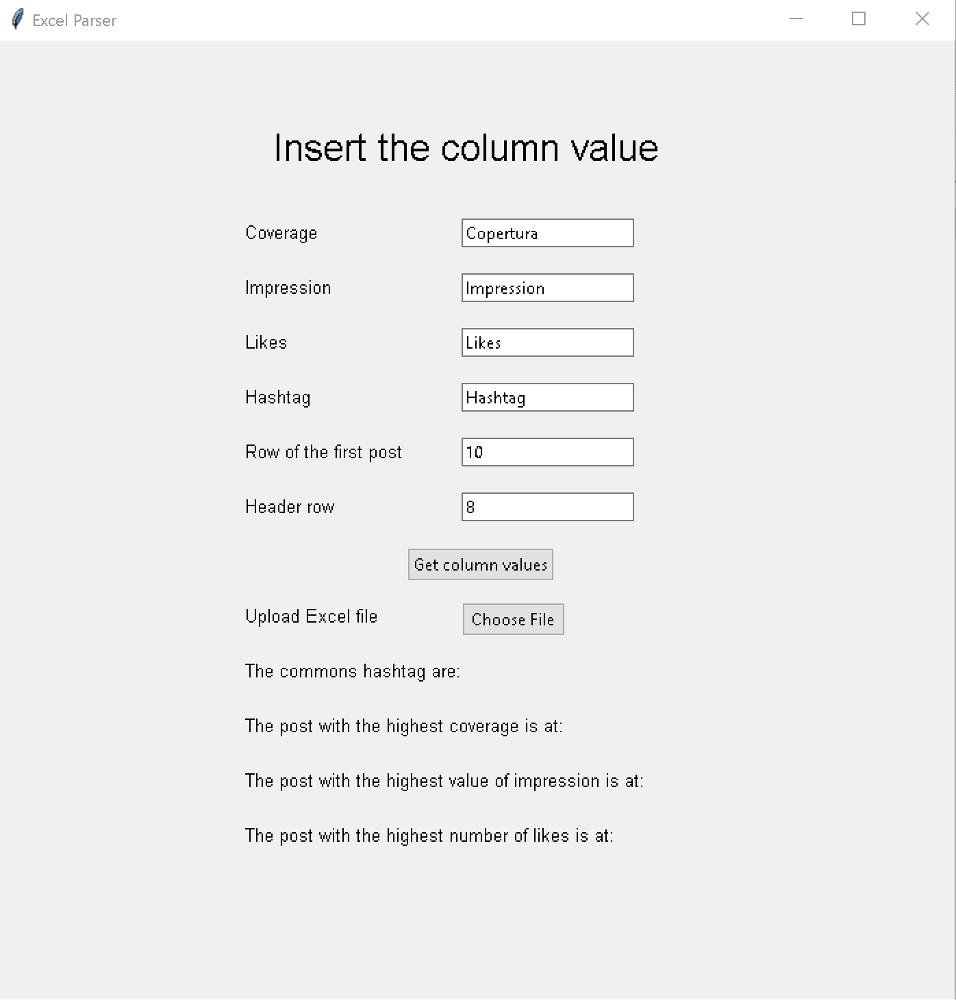

# Excel Parser

I developed this tool to improve my knowledge about python.

This excel parser is designed to search in a editorial plan for facebook and instagram provided as xlms file the columns with the text "Copertura", "Likes", "Impression" and "Hashtag" and to determinate the rows used inside the file.  
When the columns are detected, it will search the rows with the highest value for the columns "Copertura", "Likes" and "Impression" and it will extract and compare the hashtag of each row to determinate the hashtag in common.  

## Execution and usage

Two ways to execute the tool:

1. Download and executes the scripts from the command line;
2. Download and launch the exe file.

### Scripts

    git https://github.com/DanieleCalzetti/excelparser.git 
    cd excelparser/
    python -m venv <virtual environment>
    <virtual environment>\Scripts\activate
    pip install -r requirements.txt
    python main.py

### Exe file

- Download of the existing exe

  - Open in browser https://github.com/DanieleCalzetti/excelparser/blob/master/dist/excel_parser.exe
  - Click on Download

  or use the command

        wget https://github.com/DanieleCalzetti/excelparser/blob/master/dist/excel_parser.exe

- Create the file exe

        git clone https://github.com/DanieleCalzetti/excelparser.git
        cd excelparser/
        python -m venv <virtual environment>
        <virtual environment>\Scripts\activate
        pip install -r requirements.txt
        pip install pyinstaller
        pyinstaller --onefile main.py read_document.py -w 

### Excel structure

The editorial plan parsed contains the post made on instagram or facebook and their metrics.

Each post in the column **A** can not be empty, to determinate the rows used the script will check from the row of the first post if it is empty (None).  
If it is empty it will assume that no more rows are used and there aren't more posts.  
If it is **not** empty it will check the content of the next role.

### Usage

Once launched it will be opened a GUI like below.

The values from Coverage to Header row can be customized they have a default value showed in the picture:

- Coverage: to detect the column with the string "Copertura";
- Impression: to detect the columns with the string "Impression";
- Likes: to detect the columns with the string "Likes";
- Row of the first post: to determinate where is the first post;
- Heder row: row where are inserted the headers "Coverage", "Impression", "Likes" and "Hashtag".

The default values are based on the editorial plan of an italian Social Media Manager but they can be changed.  

If the value are correct **or** are changed click on the button **"Get column values"** --> **"Choose File"** --> select an xlsx.

If all the headers are found it will print the hashtag in common among the posts with the highest coverage, highest impression and highest number of likes.  

If the header are not found it will print an error message to check the header.

## Known issues

- Slow tool and maybe hard to read: I want to improve speed  readbility and usability but before that I have to understand few technical things;
- test other excel file formats, currently the tool only accept excel with the extension xlsx.
